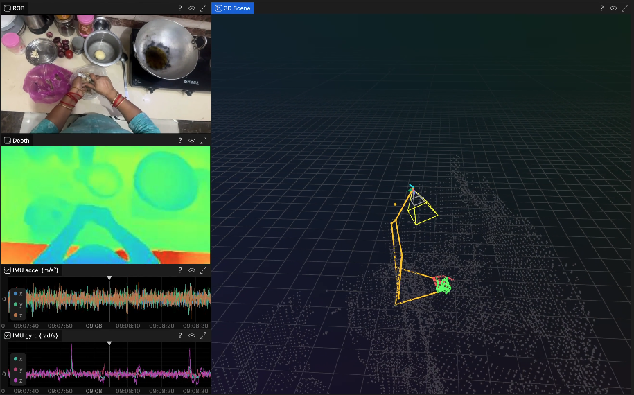

<h1 align="center">
  
   Stera SDK
</h1>
<p align="center">by <a href="https://fpvlabs.ai">FPV Labs</a> (<a href="https://fpvlabs.ai">fpvlabs.ai</a>)</p>

<p align="center">
  <a href="https://pypi.org/project/stera-sdk/"></a>
  <a href="https://pypi.org/project/stera-sdk/"></a>
  <a href="https://www.apache.org/licenses/LICENSE-2.0"></a>
</p>

<a href="https://apps.apple.com/us/app/fpv-labs/id6756263398"></a>

`stera-sdk` is the Python SDK behind *Stera* ([website](https://fpvlabs.ai/stera) · [iOS app](https://apps.apple.com/us/app/fpv-labs/id6756263398)).

Load MCAP recordings, run swappable hand, face, and skeleton models behind one schema,
and visualize or export clean episodes, ready for embodied AI, VLAs, and world models.

### A short taste

```python
import stera
from stera.data import MCAPReader
from stera.models import HandTracker, FaceBlurrer
from stera.viz import Visualizer
from stera.processing import MeshRefiner
from stera.eval import Evaluate

session = MCAPReader("recording.mcap")
hands   = HandTracker(model="mediapipe")
blur    = FaceBlurrer(model="mediapipe")
viz     = Visualizer(session, map_3d="auto")

for frame in session.frames():
    blurred = blur.blur(frame)
    poses   = hands.detect_hands(frame)
    session.add_rgb_frame(frame.index, blurred)
    session.add_hand_pose(frame.index, poses)
    viz.log_frame(frame, hands=poses)

mesh = MeshRefiner(session).refine()           # clean + densify + colorize
session.export("episodes/run_01", visualizer=viz, mesh=mesh)
Evaluate(session).show()                       # interactive HTML QC report
```

<p align="center">
  
</p>

## Getting started

```bash
pip install "stera-sdk[all]"
```

That pulls the core SDK plus MediaPipe, RetinaFace, and `MeshRefiner` deps.
WiLoR, HaMeR, and EgoBlur ship as separate research repos, see the [installation guide](https://admirable-toffee-75133f.netlify.app/docs/process/get-started/installation).
`ffmpeg` must be on `PATH` for episode export.

## Documentation

- 📚 [Docs](https://admirable-toffee-75133f.netlify.app/docs)
- 🚀 [Quickstart](https://admirable-toffee-75133f.netlify.app/docs/process/get-started/quickstart)
- ⚙️ [API reference](https://admirable-toffee-75133f.netlify.app/docs/process/api)
- 🛠️ [Installation](https://admirable-toffee-75133f.netlify.app/docs/process/get-started/installation)

## License

Apache 2.0 © [FPV Labs](https://fpvlabs.ai)
